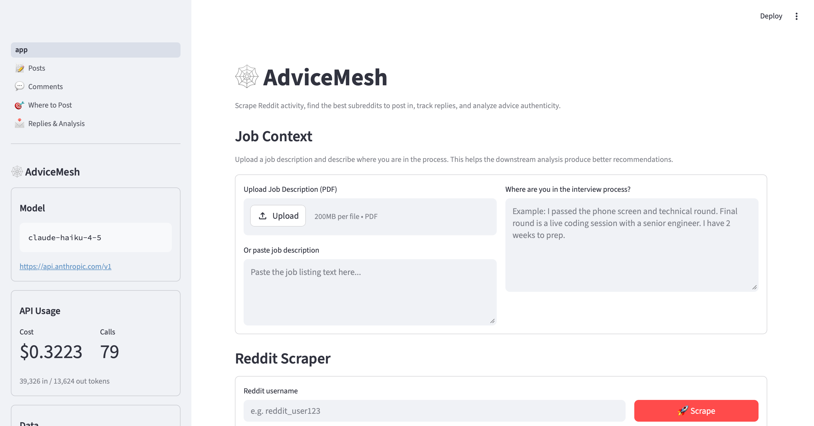
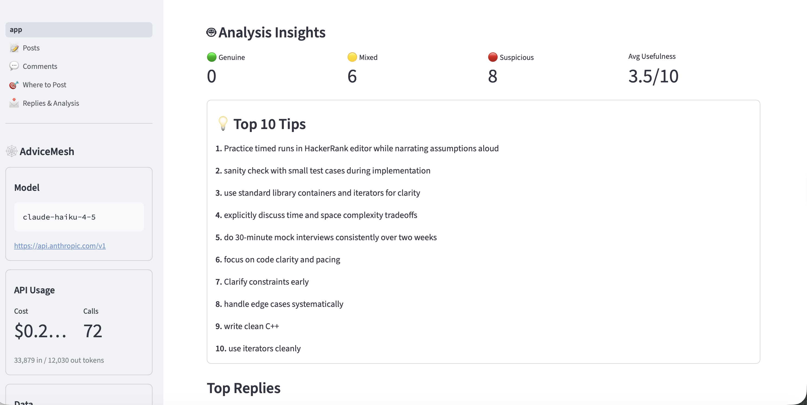

# 🕸️ AdviceMesh

An AI-powered tool for job seekers who use Reddit to prepare for interviews. Upload a job description, scrape advice from Reddit communities, and let Claude analyze which tips are genuine and actionable.

## 🚀 What it does

1. 📄 **Upload** a job description (PDF or text) and describe your interview stage
2. 🔍 **Scrape** your Reddit history to see where you've posted and engaged
3. 🧠 **Filter** subreddits by relevance using Claude (removes unrelated communities)
4. 🎯 **Find** the best subreddits to post your interview question
5. 📩 **Track** replies and advice across all your posts
6. 🤖 **Analyze** each reply for authenticity and usefulness with Claude
7. 💬 **Chat** with Claude about the collective advice you've received
8. 🔎 **Discover** new relevant subreddits with AI-powered evaluation
9. ⬇️ **Download** study plans and analysis results as markdown or CSV

## 📸 Demo

### Home Page


### Analysis Insights


### Full Demo


https://github.com/user-attachments/assets/1dd65287-f0cb-4db3-b0f5-61ef8871842e


> Upload a job description, scrape Reddit, and get AI-powered analysis of interview advice.

## 📄 Pages

| Page | Description |
|------|-------------|
| 🏠 Home | Upload JD, set interview stage, scrape Reddit, view overview + inline analysis |
| 📝 Posts | Browse all scraped posts with clickable links |
| 💬 Comments | Browse all scraped comments |
| 🎯 Where to Post | Already posted vs not yet posted, preview/copy posts, discover new subs |
| 📩 Replies & Analysis | View replies, quick-analyze individual ones, batch analysis with filters, chat with Claude |

## 💡 How to use it

1. On the **Home** page, upload a job description PDF and describe your interview stage
2. Enter your Reddit username and click **Scrape**
3. Claude filters your communities to only show relevant ones
4. Click **Analyze All Replies** to score every reply for authenticity and usefulness
5. Browse **Where to Post** to find subreddits you haven't posted in yet
6. On **Replies & Analysis**, chat with Claude about the advice or download study plans

## ⚙️ Setup

### Prerequisites

- 🐍 Python 3.11+
- 📦 [Poetry](https://python-poetry.org/)
- 🔑 An [Anthropic API key](https://console.anthropic.com/)

### Install

```bash
git clone https://github.com/codedroid404/advice-mesh.git
cd advice-mesh
source setup.sh
```

### Configure

Create a `.private_.env` file (see `.env.example`):

```
CLAUDE_API_KEY=your_anthropic_api_key_here
CLAUDE_BASE_URL=https://api.anthropic.com/v1
CLAUDE_MODEL=claude-sonnet-4-6
```

Then run `source setup.sh` to generate config.

### Run

```bash
streamlit run app.py
```

## 🧪 Testing

```bash
# Run all tests
pytest

# Unit tests only
pytest -m "not integration"

# Integration tests (hits Reddit + Claude APIs)
pytest -m integration -v -s
```

✅ **74 tests** — 64 unit + 10 integration covering parsing, formatting, data logic, file I/O, PDF reading, subreddit filtering, analyzer context, Reddit API, and Claude API.

## 🗂️ Project Structure

```
advice-mesh/
├── app.py                      # Home — JD upload, scrape, overview, inline analysis
├── pages/
│   ├── 0_Settings.py           # API key + connectivity test
│   ├── 1_Posts.py              # Posts table
│   ├── 2_Comments.py           # Comments table
│   ├── 3_Where_to_Post.py      # Post distribution + discovery
│   └── 4_Replies_&_Analysis.py # Replies + batch analysis + chat
├── src/
│   ├── analyzer.py             # Claude analysis + LLM subreddit filter
│   ├── config.py               # Settings loader (JSON or .env)
│   ├── discovery.py            # Auto-discover new subreddits
│   ├── finder.py               # Subreddit metadata + cross-check
│   ├── logger.py               # Colored terminal logging
│   ├── post_content.py         # Post formatting per subreddit
│   ├── posting.py              # Posting log persistence
│   ├── replies.py              # Reply fetcher with automod filtering
│   ├── scraper.py              # Reddit user history scraping
│   ├── shared.py               # Shared sidebar + helpers
│   ├── subreddit_config.py     # Candidate subs by domain
│   └── usage_tracker.py        # API token/cost tracking
├── test/                       # 74 unit + integration tests
├── data/                       # Runtime data (gitignored)
│   ├── analysis_cache.json     # Cached analysis results
│   ├── api_usage.jsonl         # API token tracking
│   ├── qa_log.json             # Chat Q&A history
│   ├── posting_log.json        # Manual posting tracker
│   └── discovered_subs.json    # Approved/rejected subs
├── CLAUDE.md                   # Claude Code project guide
├── STREAMLIT_GUIDE.md          # Streamlit patterns reference
├── CHANGELOG.md                # Version history
├── setup.sh                    # Environment setup
├── pyproject.toml              # Poetry dependencies
└── pytest.ini                  # Test configuration
```

## 🛠️ Tech Stack

| Component | Tool |
|-----------|------|
| 🖥️ UI | Streamlit (multipage app) |
| 🔴 Reddit | `requests` + Reddit public JSON API |
| 🧠 LLM | Anthropic Claude API |
| 📊 Data | pandas |
| 📄 PDF | PyMuPDF |
| ⚡ Caching | `@st.cache_data` (5 min TTL) |
| 🧪 Testing | pytest |
| ⚙️ Config | python-dotenv + Settings page |

## 👤 Author

**Sita Sanon** — [LinkedIn](https://www.linkedin.com/in/sita-sanon-a15775269/)
